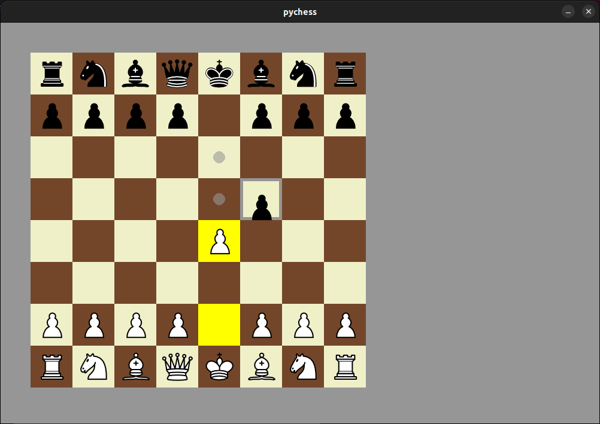

# pychess

pychess is a chess game implemented in Python with pygame library. It supports castling, en passant, 50 moves rule, threefold repetition, etc.

## Install

1. Clone the repository
2. Install requirements
3. Run the game

```
git clone https://github.com/fffelix-huang/pychess.git
pip install -r requirements.txt
python3 main.py
```

## Gameplay


![result][images/result.png]

## Contribution

Any feedback are welcome, and feel free to send pull requests!
