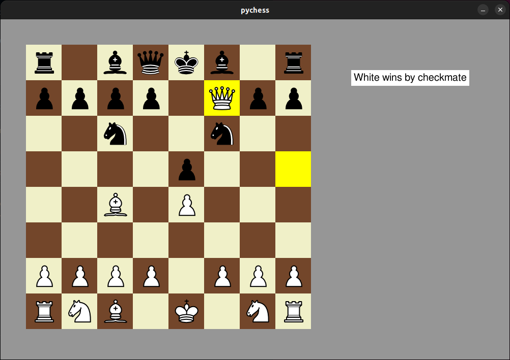

# pychess

pychess is a chess game implemented in Python with pygame library. It supports pawn promotion, castling, en passant, 50 moves rule, threefold repetition, etc.

## Install

1. Clone the repository
2. Install dependencies
3. Run the game

```
git clone https://github.com/fffelix-huang/pychess.git
pip3 install -r requirements.txt
python3 main.py
```

## Screenshots

| Gameplay | Result |
| :---: | :---: |
|  |  |
| Drag pieces around. | Result will be shown when the game terminates. |

## Contribution

Any feedback is welcome, and please feel free to submit pull requests!
